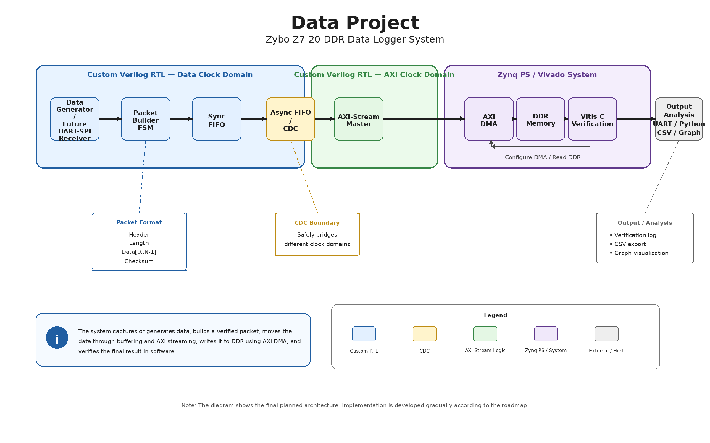

# Data Project — Zynq DDR Data Logger


> **Data Project** is a step-by-step FPGA / SoC project implemented on the **Zybo Z7-20** board.  
> The project demonstrates a complete data path from custom Verilog RTL, through packet generation, FIFO buffering, AXI-Stream, AXI DMA, DDR memory, and software verification using Vitis C.

---

## Table of Contents

- [Project Overview](#project-overview)
- [Tools and Platform](#tools-and-platform)
- [System Block Diagram](#system-block-diagram)
- [System Architecture](#system-architecture)
- [Key Design Features](#key-design-features)
- [Data Packet Format](#data-packet-format)
- [Development Roadmap](#development-roadmap)
- [Project Structure](#project-structure)
- [Documentation](#documentation)
- [Validation Plan](#validation-plan)
- [Final Goal](#final-goal)
- [Author](#author)

---

## Project Overview

The goal of this project is to build a complete FPGA/SoC data logging system.

The system starts with a controlled data source inside the FPGA fabric.  
The data is packed into a structured packet, buffered, transferred using AXI-Stream, written into DDR memory using AXI DMA, and verified by software running on the ARM processor inside the Zynq Processing System.

This project is designed as a professional portfolio project that demonstrates both hardware design and system-level integration.

---

## Tools and Platform

* **Target Board:** Zybo Z7-20
* **FPGA / SoC:** Xilinx Zynq-7000
* **Hardware Design Tool:** Vivado
* **Hardware Description Language:** Verilog HDL
* **Software Tool:** Vitis C
* **Version Control:** Git / GitHub
* **Future Data Analysis:** Python / CSV / Graph

---

## System Block Diagram

<p align="center">
  
</p>

<p align="center">
  <em>High-level architecture of the planned Data Project system.</em>
</p>

> The diagram shows the final planned architecture.  
> The implementation is developed gradually according to the project roadmap.

---

## System Architecture

The planned final system architecture is:

```text
Data Generator / Communication Receiver
        ↓
Packet Builder FSM
        ↓
Sync FIFO
        ↓
Async FIFO / CDC
        ↓
AXI-Stream Master
        ↓
AXI DMA
        ↓
DDR Memory
        ↓
Vitis C Verification
        ↓
UART Terminal / Python / CSV / Graph
```

The first implementation uses an internal **Data Generator**.  
In a later stage, the internal source can be replaced with a real communication interface such as **UART** or **SPI**.

---

## Key Design Features

### 1. Modular RTL Design

The system is built from separate RTL blocks.

Each block has a clear role, its own testbench, and its own verification process.

Main RTL blocks include:

- Data Generator
- Packet Builder FSM
- Sync FIFO
- AXI-Stream Master
- Async FIFO / CDC
- Full RTL Integration Testbench
- Separate custom IP blocks for Vivado Block Design

---

### 2. Structured Packet Format

The project does not transfer random raw values.

The data is packed into a structured format:

```text
Header → Length → Data Words → Checksum
```

This makes the data easier to verify in simulation, DDR memory, and software.

---

### 3. Testbench-Based Verification

Each RTL block is verified separately before being connected to the next block.

After the individual block simulations, the verified blocks are connected in a full RTL integration testbench. This confirms the complete path from Data Generator through Packet Builder FSM, Sync FIFO and AXI-Stream Master before moving to IP packaging and Vivado Block Design.

This helps isolate bugs and follows a professional FPGA development flow.

---

### 4. AXI-Stream and AXI DMA Integration

The custom RTL logic will communicate with AXI DMA using AXI-Stream.

AXI DMA is used to transfer data from the programmable logic into DDR memory efficiently, without requiring the CPU to copy every word manually.

---

### 5. DDR and Software Verification

The final packet will be stored in DDR memory.

A Vitis C program will read the DDR buffer and verify:

- Header
- Length
- Data order
- Checksum
- PASS / FAIL result

---

### 6. Clock Domain Crossing

After the basic DMA and DDR flow works, the design will be extended with an Async FIFO for safe Clock Domain Crossing.

This makes the project closer to real FPGA systems, where different parts of the design often operate with different clocks.

---

## Data Packet Format

The system uses a simple packet format:

```text
Word 0: Header
Word 1: Length
Word 2: Data[0]
Word 3: Data[1]
...
Word N: Data[N-1]
Word N+1: Checksum
```

Initial example:

```text
Header   = 0xA5A50001
Length   = 6
Data     = 1, 7, 8, 3, 6, 3
Checksum = 28 = 0x0000001C
```

Expected packet:

```text
Word 0: 0xA5A50001
Word 1: 0x00000006
Word 2: 0x00000001
Word 3: 0x00000007
Word 4: 0x00000008
Word 5: 0x00000003
Word 6: 0x00000006
Word 7: 0x00000003
Word 8: 0x0000001C
```

The full protocol is documented in:

```text
docs/data_protocol.md
```

---

## Development Roadmap

The project is developed according to the following stages:

| Stage | Name |
|---:|---|
| 0 | GitHub + Project Structure |
| 1 | Data Protocol |
| 2 | Data Generator + Testbench |
| 3 | Packet Builder FSM + Testbench |
| 4 | Sync FIFO + Testbench |
| 5 | AXI-Stream Master + Testbench |
| 6 | Full RTL Integration Simulation |
| 7 | Custom IP Packaging + Vivado Block Design |
| 8 | Vitis C Verification |
| 9 | Async FIFO + CDC + Testbench |
| 10 | Full Integration with CDC + DMA + DDR |
| 11 | ILA + Vivado Reports |
| 12 | Python CSV / Graph |
| 13 | UART or SPI Extension |
| 14 | Portfolio Polish |

For progress tracking, see the project checklist in the documentation folder.

Current progress: Stages 0-6 are complete. The next stage is Stage 7 - Custom IP Packaging + Vivado Block Design.

---

## Project Structure

```text
Data_Project/
├── docs/       Project documentation, work plan, checklist and protocol
├── images/     Block diagrams, waveforms and screenshots
├── python/     Python scripts for CSV and graphs
├── reports/    Timing, utilization and simulation reports
├── rtl/        Verilog RTL source files
├── tb/         Testbench files
├── vitis/      Vitis C software
├── vivado/     Vivado project files and block design notes
└── README.md
```

---

## Documentation

Main documentation files:

- **Work Plan:** `docs/work_plan.md`
- **Data Protocol:** `docs/data_protocol.md`
- **Project Checklist:** `docs/project_checklist.md`
- **Hebrew Checklist PDF:** `docs/Data_Project_Checklist_HE.pdf`
- **Block Diagram:** `images/data_project_block_diagram.png`
- **Full Project Plan:** `docs/תוכנית עבודה.pdf`

---

## Validation Plan

The project will be validated in several levels:

### Behavioral Simulation

Each RTL block will be tested separately using a dedicated testbench.

### Full RTL Simulation

The full custom RTL chain is simulated using an integration testbench before connecting it to Vivado Block Design, AXI DMA and DDR.

### Vivado Hardware Integration

The RTL design will be connected to Zynq PS, AXI DMA, and DDR using Vivado Block Design.

### Vitis C Verification

A C program will control the DMA, read the DDR buffer, and verify the received packet.

### Hardware Debug

ILA will be used to inspect internal FPGA signals during real hardware execution.

### Python Visualization

Python will be used later to export data, create CSV files, and generate graphs.

---

## Final Goal

The final goal is to demonstrate a complete FPGA / SoC data path from RTL to DDR memory and software verification.

The project is intended to show the ability to:

- Design custom Verilog RTL
- Write testbenches
- Build FSM-based control logic
- Use FIFO buffering
- Work with AXI-Stream
- Integrate AXI DMA and DDR
- Write Vitis C verification software
- Handle Clock Domain Crossing
- Use ILA for hardware debugging
- Document a project professionally on GitHub

---

## Conclusion

Data Project is a structured FPGA / SoC development project.

It starts from simple RTL blocks and gradually grows into a full Zynq-based DDR data logging system.

The focus is not only on making the system work, but also on understanding, verifying, documenting, and explaining every stage clearly.

---

## Author

Created by **Dvir Gedanken** as an FPGA / SoC portfolio project.
