<style>
body, .markdown-body, .vscode-body { direction: rtl; text-align: right; }
th, td { text-align: right; }
pre, code, pre * { direction: ltr; text-align: left; unicode-bidi: embed; }
ul, ol { padding-right: 24px; padding-left: 0; }
blockquote { border-right: 3px solid #e0a800; border-left: none; padding-right: 12px; }
</style>

# Data Project — Zynq DDR Data Logger
## דוח תיעוד פרויקט

**Dvir Gedanken** · פרויקט FPGA / SoC

| | |
|---|---|
| **כרטיס פיתוח** | Digilent Zybo Z7-20 |
| **רכיב** | Xilinx Zynq-7000, `XC7Z020-CLG400-1` |
| **סביבת פיתוח** | Vivado 2019.1 |
| **שפת תיאור חומרה** | Verilog HDL |
| **תדר עבודה** | 50 MHz (`FCLK_CLK0`) |
| **ניהול גרסאות** | Git / GitHub |
| **היקף הדוח** | שלבים 0–8: מתשתית הפרויקט ועד Bitstream ואינטגרציית DMA/DDR מלאה |

---

## תקציר מנהלים

הפרויקט מממש **מסלול נתונים (Data Path)** במערכת FPGA/SoC מבוססת Zynq-7000: מייצור נתונים בלוגיקה המתוכנתת (PL), דרך אריזתם ב-Packet מובנה, אגירה ב-FIFO, המרה לפרוטוקול AXI4-Stream, ועד חיבורם ל-AXI DMA ולנתיב הכתיבה אל זיכרון ה-DDR של מערכת העיבוד (PS).

> **מצב האימות בכתיבת דוח זה:** מסלול ה-RTL אומת במלואו בסימולציה, ואינטגרציית החומרה ב-Vivado הושלמה עד Bitstream ו-Hardware Export. **אימות Runtime** של העברת ה-DMA וקריאת ה-Packet בפועל מה-DDR **עדיין בתהליך** — ראו סעיף 13.

האתגר המרכזי אינו כתיבת בלוק RTL בודד, אלא **חיבור נכון של שני עולמות**: הלוגיקה המתוכנתת שעובדת בזרימת נתונים (Streaming), ומערכת המעבד שעובדת בגישה לזיכרון (Memory-Mapped). הגשר בין השניים הוא ה-AXI DMA.

הפרויקט נבנה בשיטת **Bottom-Up מאומתת**: כל בלוק RTL נכתב, אומת ב-Testbench ייעודי, ורק לאחר מכן חובר לשרשרת. לאחר אימות השרשרת המלאה בסימולציה, הבלוקים נארזו כ-Custom IP ושולבו ב-Vivado Block Design מול ה-Zynq PS וה-AXI DMA.

| מדד | תוצאה |
|---|---|
| אימות RTL ברמת בלוק | 4/4 בלוקים — PASS |
| אימות אינטגרציה מלאה בסימולציה | PASS — 9/9 מילים, `tlast` תקין |
| Implementation | הושלם, Design State: **Routed** |
| Setup Timing (WNS) | **+11.884 ns** מתוך תקציב 20 ns |
| Hold Timing (WHS) | **+0.035 ns** |
| Failing Endpoints | **0** מתוך 6,624 |
| הערכת תדר מתוך Setup Slack | ≈ 123 MHz — **אינדיקציה בלבד**, לא Fmax מוכח |
| ניצול — RTL מותאם אישית | 153 LUTs, 204 FFs (0.29% מהרכיב) |
| ניצול — מערכת מלאה | 1,746 LUTs, 2,293 FFs, 1 BRAM |
| Bitstream + Hardware Export | הושלמו |

**תוכן:** 1. מטרות · 2. ארכיטקטורה · 3. שלבים 0–1 · 4. שלב 2 · 5. שלב 3 · 6. שלב 4 · 7. שלב 5 · 8. שלב 6 · 9. שלב 7 · 10. שלב 8 · 11. תוצאות Implementation · 12. אתגרים ופתרונות · 13. מגבלות והמשך פיתוח · 14. סיכום · נספח

---

## 1. מטרות הפרויקט

### 1.1 המטרה ההנדסית
לבנות מערכת **Data Logger** על Zynq-7000, שבה נתונים הנוצרים בלוגיקה המתוכנתת עוברים בצורה מבוקרת ומאומתת אל זיכרון ה-DDR — עם יכולת להסביר, לאמת ולתעד כל חוליה במסלול.

### 1.2 עקרונות התכנון

| עקרון | כיצד יושם |
|---|---|
| **מודולריות** | כל פונקציה בבלוק Verilog נפרד עם ממשק מוגדר. אין בלוק מונוליטי אחד. |
| **אימות הדרגתי** | Testbench לכל בלוק לפני חיבור לשרשרת. שגיאה מבודדת לבלוק אחד ולא למערכת שלמה. |
| **נתונים ידועים מראש** | הרצף `1, 7, 8, 3, 6, 3` נבחר כדי שכל מילה תזוהה בקלות ב-Waveform וב-DDR. |
| **מבנה נתונים מוגדר** | Header + Length + Data + Checksum — לא נתונים גולמיים. |
| **תיעוד תוך כדי עבודה** | דוחות, Waveforms ו-Screenshots נשמרים ב-Repository בכל שלב. |

### 1.3 היכולות שהפרויקט מדגים
תכנון RTL מותאם אישית ב-Verilog כולל לוגיקת בקרה מבוססת FSM · כתיבת Testbenches עם בדיקות אוטומטיות ותוצאת PASS/FAIL · פרוטוקול Handshake מסוג Valid/Ready · יישום AXI4-Stream Master תקני · אריזת RTL כ-Vivado Custom IP והרכבת מערכת ב-Block Design · אינטגרציית PL↔PS הכוללת AXI DMA, AXI Interconnect, HP Port ומפת כתובות · ניתוח דוחות Vivado של Timing, Utilization ו-Placement.

---

## 2. ארכיטקטורת המערכת


### 2.1 מסלול הנתונים

```text
BTN0 (pin K18) ──start──┐
                        ▼
  ╔═ Programmable Logic — 50 MHz ═══════════════════════════════════╗
  ║  Data Generator ──data_out[31:0] / data_valid──▶                ║
  ║        ◀────────── data_ready ──────────────────                ║
  ║  Packet Builder FSM ──packet_word_out[31:0] / packet_valid──▶    ║
  ║  Sync FIFO (32 bit × 16) ──dout[31:0] / empty──▶                ║
  ║        ◀────────── rd_en ───────────────────────                ║
  ║  AXI-Stream Master ──tdata / tvalid / tlast / tkeep──▶           ║
  ╚═════════════════════════════════════╤═══════════════════════════╝
                                        ▼ AXI4-Stream
        AXI DMA 7.1 (Simple Mode, S2MM only) ◀── S_AXI_LITE (בקרה מה-PS)
                                        ▼ AXI4 Memory-Mapped
        Zynq PS — S_AXI_HP0  ──▶  DDR3 Memory
```

### 2.2 תחומי שעון ואיפוס

| נושא | יישום |
|---|---|
| **שעון** | שעון יחיד. `FCLK_CLK0` בתדר 50 MHz מזין את ארבעת בלוקי ה-RTL המותאמים, את ה-AXI DMA, את שני ה-Interconnect ואת פורטי ה-AXI של ה-PS. |
| **מדוע שעון יחיד** | כל מסלול ה-PL המותאם וממשקי ה-AXI הרלוונטיים בתכנון מוזנים מ-`FCLK_CLK0`, ולכן **אין כרגע CDC בלוגיקה שמימשתי**. מעברי שעון פנימיים ב-PS ובבקר ה-DDR מטופלים על ידי תשתית Xilinx. זו החלטה מכוונת שמסירה סיכון Metastability מהלוגיקה שלי בשלב שבו המטרה היא להוכיח את מסלול ה-DMA. Async FIFO ו-CDC מתוכננים כהרחבה (שלב 10). |
| **איפוס AXI** | `proc_sys_reset_0` מקבל `FCLK_RESET0_N` מה-PS ומייצר `peripheral_aresetn` ו-`interconnect_aresetn` (Active-Low) עבור ה-DMA וה-Interconnect. |
| **איפוס RTL מותאם** | בלוקי ה-RTL שנכתבו משתמשים ב-Reset **סינכרוני Active-High**, ולכן חוברו ליציאת `peripheral_reset` — היציאה Active-High של אותו IP. כך נשמרת התאמת פולריות ללא שערי היפוך. |

### 2.3 בלוקי המערכת

| בלוק | מקור | תפקיד |
|---|---|---|
| `data_generator` | **RTL מותאם** | מקור נתונים פנימי מבוקר |
| `packet_builder_FSM` | **RTL מותאם** | אריזת הנתונים ל-Packet וחישוב Checksum |
| `sync_fifo` | **RTL מותאם** | אגירת ה-Packet והפרדת קצבי כתיבה/קריאה |
| `axi_stream_master` | **RTL מותאם** | המרת הנתונים לפרוטוקול AXI4-Stream |
| `axi_dma_0` | Xilinx IP 7.1 | העברת ה-Stream לזיכרון ה-DDR |
| `processing_system7_0` | Xilinx IP 5.5 | מעבד ARM, בקר DDR |
| `axi_interconnect_0` / `_ctrl` | Xilinx IP 2.1 | נתיב נתונים אל HP0 · נתיב בקרה אל ה-DMA |
| `proc_sys_reset_0` | Xilinx IP 5.0 | ייצור אותות איפוס מסונכרנים |

---

## 3. שלבים 0–1 — תשתית ופרוטוקול הנתונים

### 3.1 שלב 0 — תשתית הפרויקט
הוקם Repository ב-Git/GitHub עם מבנה תיקיות מופרד לפי סוג תוצר (`rtl/`, `tb/`, `docs/`, `images/`, `reports/`, `ip_repo/`, `vivado/`), README בעברית ובאנגלית, תוכנית עבודה ו-Checklist למעקב. הוגדר `.gitignore` המסנן תוצרי Build של Vivado.

תיקיות `reports/` ו-`images/` אינן קוסמטיקה: הן מה שמאפשר להוכיח, שבועות לאחר הביצוע, שסימולציה אכן עברה ומה הייתה תוצאת ה-Timing.

### 3.2 שלב 1 — פרוטוקול הנתונים
**מטרה:** להגדיר **חוזה נתונים אחד** שכל הבלוקים יצייתו לו — לפני כתיבת RTL, כדי למנוע אי-התאמות בשלב האינטגרציה. **קובץ:** [docs/data_protocol.md](data_protocol.md)

| Index | שדה | ערך | | Index | שדה | ערך |
|---:|---|---|---|---:|---|---|
| 0 | Header | `0xA5A50001` | | 5 | Data[3] | `0x00000003` |
| 1 | Length | `0x00000006` | | 6 | Data[4] | `0x00000006` |
| 2 | Data[0] | `0x00000001` | | 7 | Data[5] | `0x00000003` |
| 3 | Data[1] | `0x00000007` | | 8 | Checksum | `0x0000001C` |
| 4 | Data[2] | `0x00000008` | | | **סה״כ** | **9 מילים = 36 בתים** |

**נימוקי התכנון:**

**`DATA_WIDTH = 32`** — נבחר כרוחב Word טבעי ואחיד לאורך כל ה-Custom Data Path, וממשק ה-AXI DMA הוגדר בהתאם. רוחב זהה בכל השרשרת מייתר לוגיקת Packing/Unpacking בין הבלוקים. ה-DDR Controller ב-PS מטפל בנפרד בגישה לזיכרון הפיזי — רוחב ה-AXI4-Stream אינו חייב להיות זהה לרוחב האפיק הפיזי של ה-DDR, וה-AXI DMA הוא רכיב Configurable.

**`HEADER = 0xA5A50001`** — `A5` הוא `10100101`: דפוס ביטים לא טריוויאלי שקל לזהות ב-Waveform, ואינו דומה לערכי Bus Stuck טיפוסיים כמו `0x00000000` או `0xFFFFFFFF`. לכן הוא מזהה אמין לתחילת Packet. בשני הבתים התחתונים ניתן להשתמש בעתיד כמספר גרסה או סוג Packet.

**`Checksum = Σ Data = 28 = 0x1C`** — סכימה פשוטה ולא CRC. הבחירה מכוונת: המטרה בשלב זה היא לזהות **אובדן, הוספה או שינוי בערכי הנתונים** בשרשרת ההעברה, וסכימה מספיקה לכך. CRC מוסיף לוגיקה ומסבך את הדיבוג ללא תועלת ממשית באימות מסלול.

**מגבלת הסכימה — שינוי סדר:** סכימה **אינה** מזהה שינוי סדר בלבד, שכן `1+7+8` ו-`8+1+7` נותנים את אותו ערך. לכן **סדר המילים נבדק בנפרד ב-Testbench**, שמשווה כל מילה מול המיקום הצפוי שלה במערך `expected_packet` — ולא באמצעות ה-Checksum. שתי הבדיקות משלימות זו את זו: ה-Testbench מאמת מיקום, וה-Checksum מאמת שלמות ערכים.

---

## 4. שלב 2 — Data Generator

**קבצים:** [rtl/data_generator.v](../rtl/data_generator.v) · [tb/tb_data_generator.v](../tb/tb_data_generator.v) · [reports/stage2_data_generator_simulation.md](../reports/stage2_data_generator_simulation.md)

**מטרה:** לייצר מקור נתונים **פנימי, ידוע ומבוקר** בתוך ה-FPGA, במקום להסתמך בשלב מוקדם על ממשק חיצוני.

### מדוע מקור פנימי ולא UART מההתחלה
זו החלטת תכנון מרכזית. אם הנתונים היו מגיעים מ-UART וב-DDR היה מתקבל ערך שגוי, לא היה ניתן לדעת אם התקלה בקליטת ה-UART, ב-FSM, ב-FIFO, ב-DMA או בתוכנה. מקור פנימי עם רצף קבוע מבטל את המשתנה הזה: אם ב-DDR לא מופיע `1, 7, 8, 3, 6, 3` — התקלה נמצאת **בתוך** המסלול שנבנה. החלפת המקור בממשק תקשורת אמיתי מתוכננת לשלב 14, לאחר שהמסלול מאומת.

### מה הבלוק עושה
מחזיק מונה פנימי `word_index` ודגל `active`. בעליית `start` (כשהבלוק אינו פעיל) הוא נכנס למצב פעיל, מעמיד את המילה הראשונה על `data_out` ומרים `data_valid`. לאחר מכן, בכל מחזור שעון שבו `data_ready` גבוה, הוא מקדם את המונה ומעמיד את המילה הבאה מטבלת ה-`case`. לאחר המילה השישית הוא מרים `done`, מנמיך `data_valid` ומאפס את מצבו.

| אות | כיוון | רוחב | תפקיד |
|---|---|---:|---|
| `clk` / `rst` | In | 1 | שעון · איפוס סינכרוני Active-High |
| `start` | In | 1 | פקודת התחלה |
| `data_ready` | In | 1 | הצרכן מוכן לקבל (Backpressure) |
| `data_out` | Out | 32 | מילת הנתונים |
| `data_valid` | Out | 1 | הנתון על `data_out` תקף |
| `done` | Out | 1 | כל המילים נשלחו |

### פרוטוקול Valid/Ready
מילה נחשבת כ**הועברה** רק כאשר `data_valid = 1` **וגם** `data_ready = 1` באותו מחזור שעון. אם הצרכן אינו מוכן, הבלוק **מחזיק** את המילה הנוכחית ואינו מקדם את המונה — כך לא נאבד נתון.

זהו אותו עקרון שעליו בנוי AXI4-Stream (`tvalid`/`tready`). מימושו כבר בבלוק הראשון הוא מה שמאפשר לחבר את הבלוקים בהמשך ללא שכבות התאמה.

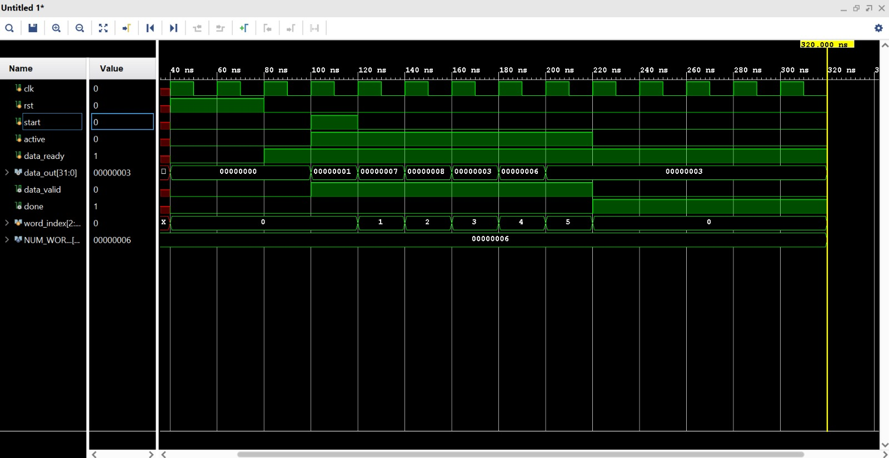

| בדיקה | תוצאה | | בדיקה | תוצאה |
|---|---|---|---|---|
| יציאות ומצב מאופסים לאחר Reset | PASS | | `data_valid` גבוה בזמן נתון תקף | PASS |
| התחלה בעקבות `start` | PASS | | `done` עולה לאחר המילה האחרונה | PASS |
| הרצף `1,7,8,3,6,3` בסדר הנכון | PASS | | קידום מותנה ב-`data_ready` | PASS |

---

## 5. שלב 3 — Packet Builder FSM

**קבצים:** [rtl/packet_builder_FSM.v](../rtl/packet_builder_FSM.v) · [tb/tb_packet_builder_FSM.v](../tb/tb_packet_builder_FSM.v)

**מטרה:** להפוך זרם מילים גולמי ל-Packet מובנה. זה השלב שבו נכנסת לפרויקט **לוגיקת בקרה אמיתית** מבוססת מכונת מצבים.

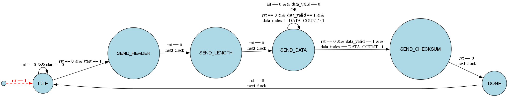

| מצב | פעולה | תנאי מעבר |
|---|---|---|
| `IDLE` | מאפס `checksum`, `data_index` והיציאות | `start == 1` → `SEND_HEADER` |
| `SEND_HEADER` | `packet_word_out <= HEADER_VALUE`, `packet_valid <= 1` | מחזור אחד → `SEND_LENGTH` |
| `SEND_LENGTH` | `packet_word_out <= DATA_COUNT`, `packet_valid <= 1` | מחזור אחד → `SEND_DATA` |
| `SEND_DATA` | כאשר `data_valid`: מעביר `data_in` ליציאה, **מוסיף אותו ל-`checksum`**, מקדם `data_index` | `data_index == DATA_COUNT-1` → `SEND_CHECKSUM`, אחרת נשאר |
| `SEND_CHECKSUM` | `packet_word_out <= checksum`, `packet_valid <= 1` | מחזור אחד → `DONE` |
| `DONE` | `packet_done <= 1`, `packet_valid <= 0` | מחזור אחד → `IDLE` |

### מבנה הקוד — הפרדה לשלושה בלוקים
ה-FSM נכתב במבנה התקני בן שלושה חלקים: **רגיסטר מצב סינכרוני** (`state <= next_state`), **לוגיקת מצב עתידי קומבינטורית** (`always @(*)` שמחשב `next_state` בלבד), ו**לוגיקת יציאות סינכרונית** בבלוק נפרד.

ההפרדה מייצרת יציאות רגיסטריות עם נתיב Timing נקי, ומונעת Glitches שהיו נוצרים אם היציאות היו קומבינטוריות ישירות מהמצב. הבלוק הקומבינטורי פותח ב-`next_state = state;` — ברירת מחדל שמונעת יצירת Latch מ-`case` לא-שלם.

### הבקרה על ה-Data Generator
```verilog
assign data_ready = (state == SEND_DATA);
```
שורה זו יוצרת את חיבור ה-Backpressure למעלה בשרשרת. ה-Generator מקבל אישור להתקדם **רק** כאשר ה-FSM נמצא במצב שבו הוא באמת מוכן לקלוט. בזמן שליחת ה-Header וה-Length, `data_ready` נמוך וה-Generator ממתין ומחזיק את מילתו הראשונה — ולכן אף נתון אינו נאבד בשני מחזורי השעון הראשונים.

### חישוב ה-Checksum
ה-Checksum נצבר **תוך כדי הזרימה** (On-the-fly): `checksum <= checksum + data_in` מתבצע באותו מחזור שבו המילה מועברת קדימה, ולא בסבב נוסף בסוף. זה חוסך אחסון של כל הנתונים ומחזורי שעון נוספים — הגישה הנכונה לעיבוד Streaming.

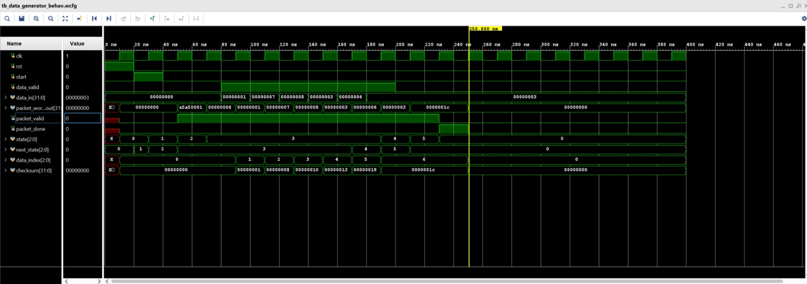

| בדיקה | תוצאה | | בדיקה | תוצאה |
|---|---|---|---|---|
| מעברי מצבים בסדר הנכון | PASS | | שש מילות נתונים בסדר הנכון | PASS |
| Header `0xA5A50001` במילה 0 | PASS | | Checksum `0x1C` במילה 8 | PASS |
| Length `6` במילה 1 | PASS | | `packet_done` עולה בסיום | PASS |

---

## 6. שלב 4 — Synchronous FIFO

**קבצים:** [rtl/sync_fifo.v](../rtl/sync_fifo.v) · [tb/tb_sync_fifo.v](../tb/tb_sync_fifo.v)

**מטרה:** לחצוץ בין ה-FSM שמייצר את ה-Packet ובין ה-AXI-Stream Master שמוציא אותו, ולנתק את קצב הכתיבה מקצב הקריאה.

### מדוע FIFO נדרש
ה-FSM מייצר את תשע המילים ברצף צמוד. ה-AXI DMA, לעומת זאת, עשוי להשהות את הקליטה — למשל אם האפיק אל ה-DDR עסוק, ואז `tready` יורד. בלי FIFO, כל השהיה כזו הייתה מחייבת את ה-FSM לעצור באמצע בניית ה-Packet ולהחזיק את מצבו הפנימי. ה-FIFO מאפשר ל-FSM **להשלים את עבודתו ולהתפנות**, בעוד ה-Packet ממתין להעברה.

**תצורה:** `DATA_WIDTH = 32` · `DEPTH = 16` (כמעט פי 2 מגודל ה-Packet — שולי ביטחון) · `ADDR_WIDTH = 4`. המימוש מבוסס על מערך `mem[0:DEPTH-1]`, מצביעי כתיבה וקריאה, ומונה תפוסה.

### פרט מימוש: רוחב מונה התפוסה
```verilog
output reg [ADDR_WIDTH:0] count;   // 5 ביטים, לא 4
```
תפוסת FIFO בעומק 16 יכולה לקבל **17** ערכים שונים (0 עד 16), ולכן 4 ביטים אינם מספיקים. שימוש ב-4 ביטים היה גורם ל-`count` לגלוש מ-16 ל-0 ולזהות FIFO מלא כ-FIFO ריק. זו טעות קלאסית במימושי FIFO, והיישום כאן מונע אותה.

### לוגיקת הגנה
```verilog
assign valid_write = wr_en && !full;
assign valid_read  = rd_en && !empty;
```
כתיבה ל-FIFO מלא או קריאה מ-FIFO ריק **אינן מבוצעות**, גם אם הבקשה הגיעה. במקום זאת מורם דגל `overflow` / `underflow` למחזור אחד, כאינדיקציה לדיבוג.

### עדכון התפוסה
```verilog
case ({valid_write, valid_read})
    2'b00: count <= count;      2'b01: count <= count - 1;
    2'b10: count <= count + 1;  2'b11: count <= count;   // מקזזות זו את זו
endcase
```
המקרה `2'b11` הוא הקריטי: כתיבה וקריאה **באותו מחזור שעון** מקזזות זו את זו והתפוסה נשארת ללא שינוי. שני `if` נפרדים היו מבצעים `count+1` ואחריו `count-1` על אותו רגיסטר בבלוק אחד — כתיבה כפולה שתוצאתה תלויה בסדר. מבנה ה-`case` על שני האותות יחד מבטיח נכונות בכל ארבעת השילובים.

### הקריאה רגיסטרית — והשלכתה על הבלוק הבא
```verilog
if (valid_read == 1) begin
    dout  <= mem[rd_pr];
    rd_pr <= rd_pr + 1;
end
```
`dout` הוא רגיסטר, ולכן הנתון זמין **מחזור שעון אחד לאחר** הרמת `rd_en`. זו התנהגות FIFO סינכרוני קלאסי (לא FWFT). ההשלכה: ה-AXI-Stream Master חייב להמתין מחזור אחד בין בקשת הקריאה ובין השימוש בנתון — וזו בדיוק הסיבה לקיומו של מצב `LOAD` ב-FSM שלו (סעיף 7).

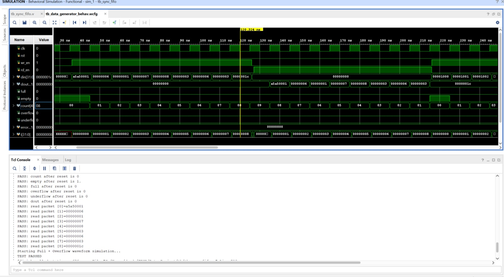

| בדיקה | תוצאה | | בדיקה | תוצאה |
|---|---|---|---|---|
| `count=0`, `empty=1`, `full=0`, `dout=0` לאחר Reset | PASS | | `full` עולה בתפוסה מלאה | PASS |
| `overflow`/`underflow` = 0 לאחר Reset | PASS | | `overflow` בכתיבה ל-FIFO מלא, והנתון אינו נכתב | PASS |
| Packet שלם — נתונים תואמים ובסדר FIFO | PASS | | `underflow` בקריאה מ-FIFO ריק | PASS |

---

## 7. שלב 5 — AXI-Stream Master

**קבצים:** [rtl/axi_stream_master.v](../rtl/axi_stream_master.v) · [tb/tb_axi_stream_master.v](../tb/tb_axi_stream_master.v)

**מטרה:** להמיר את הנתונים מממשק ה-FIFO הפנימי לפרוטוקול **AXI4-Stream** תקני, לחיבור ישיר ל-AXI DMA. זהו **הגשר בין הלוגיקה המותאמת ובין תשתית ה-Xilinx IP** — עד כאן הפרוטוקולים היו פנימיים, מכאן הם חייבים להיות תקניים.

| אות | תפקיד |
|---|---|
| `axis_tdata[31:0]` | מילת הנתונים |
| `axis_tvalid` | ה-Master מציג נתון תקף |
| `axis_tready` | **קלט** — ה-Slave (ה-DMA) מוכן לקלוט |
| `axis_tlast` | סימון המילה האחרונה ב-Packet |
| `axis_tkeep[3:0]` | סימון בתים תקפים — `4'b1111` (מילה שלמה) |
| `debug_state[3:0]` | חשיפת מצב ה-FSM כלפי חוץ, לחיבור ILA בהמשך |

### מדוע `tlast` הוא האות הקריטי
ה-AXI DMA ב-Simple Mode מזהה **סוף Packet** לפי `tlast`. בלי `tlast` על המילה התשיעית, ה-DMA לא יסיים את ההעברה ולא יעדכן את רגיסטר הסטטוס שלו, והתוכנה תיתקע בהמתנה. `tlast` על המילה **הלא נכונה** יגרום להעברה קטועה או ל-Packet מפוצל. זו הסיבה שהבדיקה של `tlast` מופיעה במפורש בכל ה-Testbenches — כולל בדיקה שהוא **אינו** עולה מוקדם מדי.

| מצב | פעולה | תנאי מעבר |
|---|---|---|
| `IDLE` | מאפס יציאות. אם `start && !fifo_empty`: מרים `fifo_rd_en` ו-`busy` | `start && !fifo_empty` → `LOAD` |
| `LOAD` | מנמיך `fifo_rd_en`. **מחזור המתנה** לנתון הרגיסטרי מה-FIFO | מחזור אחד → `SEND` |
| `SEND` | מעמיד את הנתון על `tdata`, מרים `tvalid`/`tkeep`, קובע `tlast` לפי `last_word`. עם Handshake: מקדם `word_count` ומבקש את המילה הבאה | Handshake + `last_word` → `DONE`; Handshake בלבד → `LOAD`; אחרת נשאר |
| `DONE` | מרים `done`, מנמיך `busy`, מאפס יציאות | מחזור אחד → `IDLE` |

### מדוע נדרש מצב `LOAD`
כפי שתואר בסעיף 6, `dout` של ה-FIFO זמין רק מחזור שעון אחד לאחר הרמת `rd_en`. מצב `LOAD` הוא בדיוק אותו מחזור המתנה. בלעדיו, ה-Master היה מעמיד על האפיק את הנתון **הקודם** ומשדר Packet מוסט במילה אחת.

הרצף הוא `SEND` → `LOAD` → `SEND`, כלומר מילה מועברת כל שני מחזורי שעון. זו פשרה מכוונת של Throughput לטובת פשטות ונכונות — 18 מחזורים ל-Packet במקום 9 הוא חסר משמעות במערכת הזו. שיפור למילה במחזור אפשרי באמצעות FIFO מסוג FWFT או Prefetch, ורשום כשיפור עתידי.

### שמירת ה-Handshake
```verilog
assign axis_handshake = axis_tvalid && axis_tready;
```
בתוך `SEND`, אם `tvalid` גבוה ו-`tready` נמוך, הבלוק **מחזיק** את `data_reg` על `tdata` ואינו מקדם את `word_count`. זו דרישה מחייבת של תקן AXI4-Stream: **Master אינו רשאי לשנות או להסיר `tdata`/`tvalid` לאחר שהרים `tvalid`, עד שהתקבל `tready`.** הפרת הכלל גורמת לאובדן נתונים שקט מול ה-DMA — מסוג התקלות הקשות ביותר לדיבוג בחומרה.

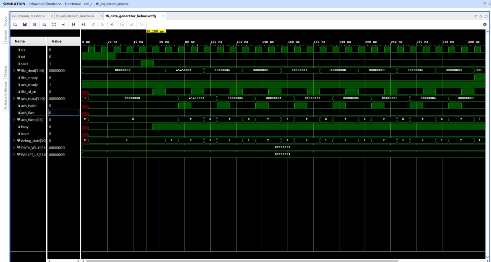

| בדיקה | תוצאה | | בדיקה | תוצאה |
|---|---|---|---|---|
| `axis_tvalid = 0` לאחר Reset | PASS | | `axis_tlast = 1` על המילה התשיעית בלבד | PASS |
| `done = 0` לאחר Reset | PASS | | `axis_tlast = 0` בכל המילים לפניה | PASS |
| כל 9 המילים בסדר ובערכים הנכונים | PASS | | מספר המילים שהתקבלו = 9 | PASS |

> **היקף האימות:** ב-Testbench זה `axis_tready` מוחזק גבוה לכל אורך ההרצה. לוגיקת החזקת הנתון בעת `tready = 0` **מומשה** ב-RTL אך לא הופעלה בבדיקה ייעודית. הפער מתועד בסעיף 13.

---

## 8. שלב 6 — אינטגרציית RTL מלאה בסימולציה

**קובץ:** [tb/tb_data_project_integration.v](../tb/tb_data_project_integration.v)

**מטרה:** לחבר את ארבעת הבלוקים המאומתים לשרשרת אחת ולאמת את **מסלול הנתונים המלא בסימולציה** — לפני מעבר ל-Block Design, ל-DMA ולחומרה.

### מדוע שלב זה נעשה לפני החומרה
זו החלטת מתודולוגיה מרכזית. דיבוג של אי-התאמת ממשקים בסימולציה לוקח דקות; אותו דיבוג לאחר Synthesis, Implementation, Bitstream ו-Bring-Up לוקח שעות, ובלי נראות לאותות פנימיים. השלב הזה **מצמצם משמעותית את מרחב החשד ב-RTL** ומאפשר להתמקד תחילה בשכבות האינטגרציה — אך אינו שולל לחלוטין בעיית RTL, במיוחד בהיבטים שלא כוסו בסימולציה (ראו סעיף 13).

### שני פרטי חיווט שנדרשו ברמת המערכת

**הגנת כתיבה ל-FIFO** — `assign fifo_wr_en = packet_valid && !fifo_full;`
תנאי ה-`!full` בין ה-FSM ל-FIFO הוא הגנה שאינה קיימת בתוך אף אחד מהבלוקים בנפרד, אלא נדרשת ברמת המערכת.

**הפעלת ה-Master בזמן הנכון** — `always @(posedge clk) axi_start <= packet_done;`
ה-Master מופעל מ-`packet_done` של ה-FSM, כלומר **רק לאחר שה-Packet כולו נכתב ל-FIFO**. הפעלה מוקדמת הייתה גורמת לו לרוץ אל תוך FIFO ריק. הרגיסטור של האות מוסיף מחזור השהיה שמבטיח שהכתיבה האחרונה הושלמה.

### מתודולוגיית הדגימה
```verilog
@(negedge clk);
if (axis_tvalid == 1'b1 && axis_tready == 1'b1) begin ...
```
הדגימה מתבצעת ב-**`negedge`** ולא ב-`posedge`. כל היציאות בתכן רגיסטריות ומשתנות ב-`posedge`; דגימה באותה נקודת זמן יוצרת Race Condition בסימולטור בין עדכון הרגיסטר ובין קריאתו. דגימה בחצי מחזור השעון מבטיחה שכל האותות התייצבו — ומונעת "כשלים" מדומים שמקורם ב-Testbench ולא ב-DUT.

### הבדיקות שבוצעו
כל אחת מ-9 המילים מול הערך הצפוי בכל Handshake תקף · `axis_tlast = 1` על המילה התשיעית בלבד · `axis_tlast = 0` בכל מילה שלפניה · מספר המילים שהתקבלו = 9 בדיוק · `axi_done` עולה בסיום · `fifo_overflow` ו-`fifo_underflow` = 0 לכל אורך ההרצה · מגן Timeout של 500 מחזורים שמונע תקיעת הסימולציה ומדווח שגיאה.

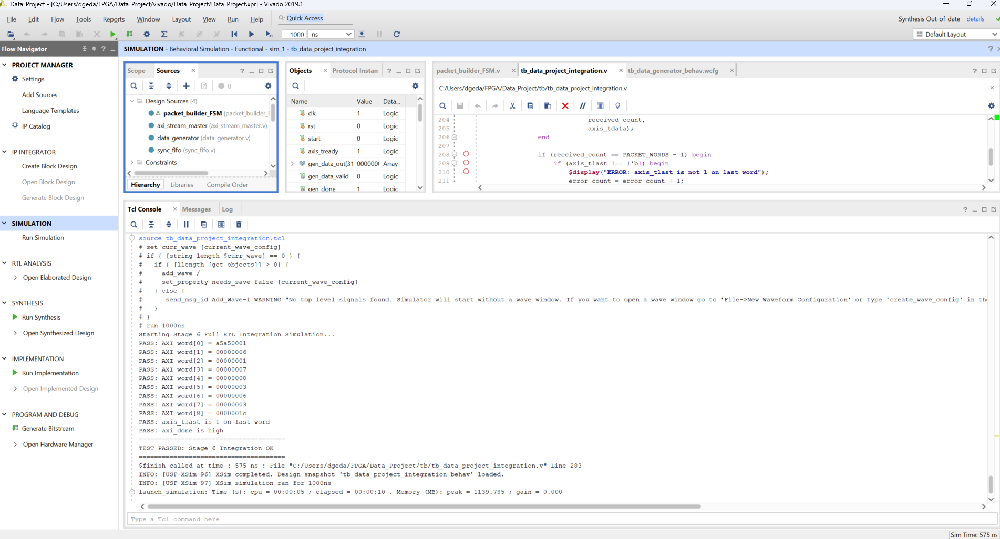

```text
Starting Stage 6 Full RTL Integration Simulation...
PASS: AXI word[0] = a5a50001      PASS: AXI word[5] = 00000003
PASS: AXI word[1] = 00000006      PASS: AXI word[6] = 00000006
PASS: AXI word[2] = 00000001      PASS: AXI word[7] = 00000003
PASS: AXI word[3] = 00000007      PASS: AXI word[8] = 0000001c
PASS: AXI word[4] = 00000008      PASS: axis_tlast is 1 on last word
                                  PASS: axi_done is high
======================================
TEST PASSED: Stage 6 Integration OK
======================================
```

זמן הסימולציה: 575 ns. **מסלול ה-RTL המלא אומת מקצה לקצה.**

---

## 9. שלב 7 — Custom IP Packaging ו-Block Design

**מטרה:** לארוז כל בלוק RTL מאומת כ-Vivado Custom IP נפרד, ולהרכיב את המערכת ויזואלית ב-Block Design.

### מדוע לארוז כ-IP — בחירת תכנון, לא חובה
אריזה כ-Custom IP **אינה נדרשת** כדי לחבר RTL ל-Block Design: Vivado מאפשר להוסיף Verilog או VHDL ישירות ל-BD באמצעות **Module Reference**. בחרתי לארוז בכל זאת, מארבע סיבות:

**ממשקים מוגדרים** — ה-`m_axis` נרשם כממשק AXI4-Stream תקני, ולכן Vivado מבצע בדיקת תאימות אוטומטית בחיבור ל-`S_AXIS_S2MM` של ה-DMA, במקום חיווט אות-אות ידני. **שקיפות ארכיטקטונית** — ה-Block Design הוא תרשים המערכת האמיתי, ומאפשר להסביר כל בלוק בנפרד. **שימוש חוזר** — IP ארוז עם `component.xml` ניתן להוספה לכל פרויקט אחר דרך ה-IP Catalog. **פרמטריזציה** — סקריפטי ה-`xgui` חושפים את `DATA_WIDTH`, `DEPTH` ו-`PACKET_WORDS` ב-GUI של Vivado.

נארזו ארבעה IP-ים תחת `ip_repo/`, כל אחד עם קובץ Verilog, `component.xml` וסקריפט `xgui`:
`xilinx.com:user:data_generator:1.0` · `packet_builder_FSM:1.0` · `sync_fifo:1.0` · `axi_stream_master:1.0`

לאחר מכן: הוספת ה-IP Repository, יצירת Block Design, חיבור הבלוקים, **Validate Design**, **Generate Output Products**, יצירת **HDL Wrapper** (`data_project_bd_wrapper`) והרצת **Synthesis**.

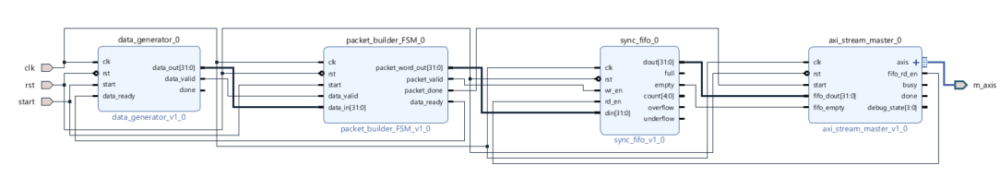

בשלב זה ה-Block Design מכיל **רק את הלוגיקה המותאמת**. `clk`, `rst` ו-`start` הם פורטים חיצוניים, ופלט ה-`m_axis` יוצא כממשק חיצוני — מוכן לחיבור ל-DMA בשלב הבא.

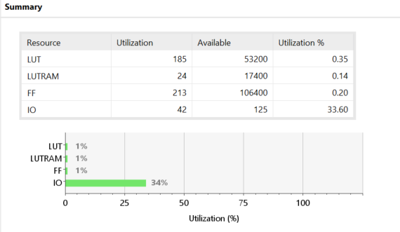

| משאב | בשימוש | זמין | אחוז |
|---|---:|---:|---:|
| LUT | 185 | 53,200 | 0.35% |
| LUTRAM | 24 | 17,400 | 0.14% |
| FF | 213 | 106,400 | 0.20% |
| IO | 42 | 125 | 33.60% |
| BRAM | 0 | 140 | 0.00% |

**קריאת התוצאות:** הלוגיקה המותאמת תופסת פחות מ-0.4% מהרכיב. ה-24 LUTRAM הם מימוש זיכרון ה-FIFO — Vivado בחר נכון ב-Distributed RAM ולא ב-Block RAM, שכן 16×32 ביט קטן מכדי לנצל BRAM שלם (36Kb). **33.6% ניצול IO** נובע מכך שבשלב זה כל האותות הפנימיים, כולל `m_axis` המלא, חשופים כפינים חיצוניים; לאחר חיבור ל-DMA הם הופכים לאותות פנימיים.

### מגבלת ה-Timing בשלב זה
דוח ה-Timing של שלב 7 מדווח `There are no user specified timing constraints` ו-261 פינים ללא שעון. **זו אינה תקלה — זו תוצאה צפויה.** בשלב 7 ה-`clk` הוא פורט קלט חיצוני ללא `create_clock`, ולכן אין תדר יעד לניתוח מולו; אין משמעות לשאלה "האם התכן עומד ב-Timing" כשלא הוגדר יעד. ניתוח Timing אמיתי התאפשר רק בשלב 8, כאשר השעון מגיע מה-Zynq PS ומקבל אילוץ אוטומטי של 50 MHz. **ההשוואה בין שני הדוחות היא בעצמה תיעוד של התהליך.**

---

## 10. שלב 8 — אינטגרציית Zynq PS, AXI DMA ו-DDR

**מטרה:** לחבר את פלט ה-AXI4-Stream של הלוגיקה המותאמת אל ה-Zynq PS וזיכרון ה-DDR באמצעות AXI DMA, ולהגיע ל-Bitstream. זהו **השלב המורכב ביותר בפרויקט**, ובו מתבצע החיבור בין עולם ה-Streaming לעולם ה-Memory-Mapped.

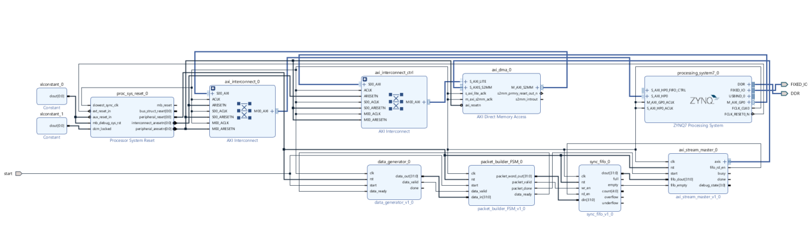

### תצורת ה-AXI DMA — מינימום המורכבות הנדרש

| פרמטר | ערך | נימוק |
|---|---|---|
| `c_include_sg` | **0** | Scatter/Gather **מבוטל** — עובדים ב-**Simple DMA Mode**. SG נדרש לרשימות מקושרות של Buffer Descriptors בזיכרון; להעברה בודדת של 36 בתים ל-Buffer רציף הוא מוסיף לוגיקה בחומרה ומורכבות ניכרת בתוכנה ללא תועלת. |
| `c_include_mm2s` | **0** | ערוץ MM2S (זיכרון→Stream) **מבוטל**. הפרויקט חד-כיווני: PL→DDR בלבד. הביטול חוסך לוגיקה משמעותית ומצמצם את שטח הבעיות. |
| ערוץ פעיל | **S2MM** | Stream to Memory-Mapped — בדיוק הכיוון הנדרש. |

### חיבורי האפיקים — שלושה ממשקים, שלושה תפקידים

| ממשק | מקור → יעד | תפקיד |
|---|---|---|
| **AXI4-Stream** | `axi_stream_master_0/axis` → `axi_dma_0/S_AXIS_S2MM` | **מסלול הנתונים** — הנתונים עצמם |
| **AXI4-Lite** | `PS/M_AXI_GP0` → `axi_interconnect_ctrl` → `axi_dma_0/S_AXI_LITE` | **מסלול הבקרה** — המעבד מגדיר ומפעיל את ה-DMA |
| **AXI4 (MM)** | `axi_dma_0/M_AXI_S2MM` → `axi_interconnect_0` → `PS/S_AXI_HP0` | **מסלול הכתיבה לזיכרון** — ה-DMA כותב ל-DDR |

הופעת שלושת סוגי ה-AXI בתכן אחד אינה מקרית: לכל אחד תפקיד שונה. Stream לזרימת נתונים ללא כתובות, Lite לגישת רגיסטרים בטרנזקציה בודדת, ו-AXI4 מלא לכתיבת Burst יעילה לזיכרון.

### מדוע HP0 ולא פורט GP
ה-DMA חובר ל-**S_AXI_HP0** (High Performance Port). פורטי ה-HP ב-Zynq-7000 מספקים נתיב רחב ומהיר יותר אל בקר ה-DDR, ומיועדים ל-Masters ב-PL שמבצעים העברות זיכרון בנפח גבוה; פורטי ה-GP מיועדים לתעבורת בקרה. ההפרדה כאן היא לפי ייעוד — **בקרה דרך GP0, נתונים דרך HP0** — כך שתעבורת הנתונים אינה מתחרה בתעבורת הבקרה.

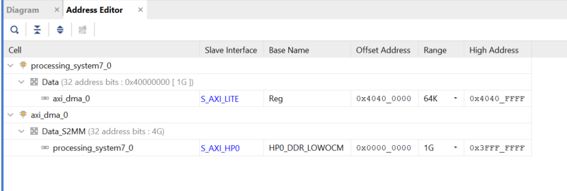

| Master | Slave | Base Address | Range | High Address |
|---|---|---|---|---|
| `processing_system7_0` / Data | `axi_dma_0` / `S_AXI_LITE` | `0x4040_0000` | 64K | `0x4040_FFFF` |
| `axi_dma_0` / `Data_S2MM` | `PS` / `S_AXI_HP0` | `0x0000_0000` | 1G | `0x3FFF_FFFF` |

**קריאת המפה — שתי שורות, שני כיוונים:**

**שורה 1:** המעבד רואה את רגיסטרי הבקרה של ה-DMA בכתובת `0x4040_0000` — במרחב ה-`0x4000_0000`, מרחב ה-Peripheral הסטנדרטי של Zynq עבור לוגיקה ב-PL.

**שורה 2:** ה-DMA — שהוא **Master בזכות עצמו** על אפיק ה-AXI — רואה את מרחב ה-DDR בגודל 1GB דרך פורט HP0. זו השורה שמאפשרת לו לכתוב לזיכרון **ללא מעורבות המעבד**. אלמלא היא, כל מילה הייתה חייבת לעבור דרך ה-CPU.

זהו לב היתרון של DMA: המעבד מבצע פעולת הגדרה אחת, וההעברה כולה מתבצעת בחומרה במקביל לעבודתו.

### חיווט הבקרה ואות ה-`start`
שרשרת ההפעלה בחומרה זהה למה שאומת בסימולציה בשלב 6: `start` מזין את `data_generator/start` ואת `packet_builder_FSM/start`, וה-`packet_done` של ה-FSM מפעיל את `axi_stream_master/start`. `peripheral_reset` מזין את ה-`rst` של כל ארבעת הבלוקים, ו-`FCLK_CLK0` את כל השעונים.

**אילוץ הפין** — `Data_Project.srcs/constrs_1/new/stage8_start_button.xdc`:
```tcl
set_property -dict { PACKAGE_PIN K18 IOSTANDARD LVCMOS33 } [get_ports {start}]
```
אות ה-`start` — הפורט החיצוני **היחיד** בכל ה-Block Design — מחובר ל-**BTN0** של ה-Zybo Z7-20. כל שאר אותות המערכת פנימיים או עוברים דרך ה-PS. זה מייצר תרחיש בדיקה נוח: התוכנה מזמינה את ה-DMA לקליטה, ולחיצת כפתור פיזית מפעילה את ייצור ה-Packet בחומרה.

### מה בוצע
הוספת Zynq PS והרצת Block Automation · הוספת AXI DMA וקביעת תצורתו · חיבור שלושת האפיקים והפעלת `S_AXI_HP0` · חיבור שעונים ואיפוסים · הגדרת מפת הכתובות ב-Address Editor · **Validate Design** — עבר · **Synthesis** ו-**Implementation** — הושלמו · **Generate Bitstream** — `data_project_bd_wrapper.bit` נוצר · **Export Hardware (including bitstream)** — החומרה יוצאה לסביבת פיתוח התוכנה.

---

## 11. תוצאות Implementation

### 11.1 Timing — התכן עומד בכל האילוצים

**מקור:** [reports/stage8_implementation_timing_summary.rpt](../reports/stage8_implementation_timing_summary.rpt) · Design State: **Routed**

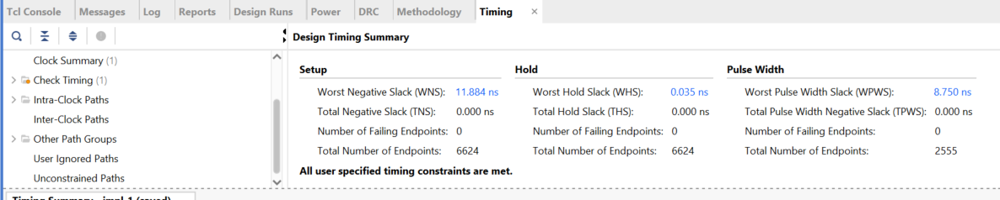

| מדד | ערך | Failing Endpoints |
|---|---:|---|
| **WNS** — Worst Negative Slack | **+11.884 ns** | **0** / 6,624 |
| **TNS** — Total Negative Slack | 0.000 ns | — |
| **WHS** — Worst Hold Slack | **+0.035 ns** | **0** / 6,624 |
| **THS** — Total Hold Slack | 0.000 ns | — |
| **WPWS** — Worst Pulse Width Slack | **+8.750 ns** | **0** / 2,555 |

```text
All user specified timing constraints are met.
clk_fpga_0   {0.000 10.000}   Period 20.000 ns   Frequency 50.000 MHz
```

**WNS = +11.884 ns מתוך תקציב 20 ns** — המסלול הקריטי צורך כ-8.1 ns, כלומר **41% מתקציב השעון**. השוליים הרחבים אינם מקריים; הם תוצאה של שני עקרונות שיושמו לאורך התכן: **יציאות רגיסטריות** בכל הבלוקים (`always @(posedge clk)` ולא `assign` על יציאות), ו**לוגיקה קומבינטורית שטוחה** ללא שרשראות חישוב עמוקות בין רגיסטרים.

**הערכת תדר מתוך ה-Slack — אינדיקציה בלבד:** החישוב `1 / (20 − 11.884) ns ≈ 123 MHz` נותן אומדן סביר לפוטנציאל התכן, אך **אינו קובע Fmax**. כדי לקבוע Fmax אמיתי יש להקטין את ה-Clock Period באילוצים ולהריץ Synthesis ו-Implementation מחדש עד Timing Closure — בתדר גבוה יותר מסלולים אחרים עשויים להיות קריטיים, והכלי מבצע אופטימיזציה שונה. הנתון מובא כאן כאינדיקציה לכך שהתכן אינו על גבול היכולת בתדר העבודה הנוכחי.

**WHS = +0.035 ns** — שולי Hold חיוביים אך צמודים, וזה **תקין וצפוי**. Hold Violation מתרחש כשמסלול **קצר מדי** בין רגיסטרים סמוכים; כלי ה-Implementation מכניס השהיות מכוונות עד להשגת שוליים חיוביים ואינו משקיע מעבר לכך. `+0.035 ns` פירושו "עבר, וזה כל מה שנדרש". להבדיל מ-Setup, שיפור Hold אינו מוסיף ערך.

**6,624 Endpoints** משקפים את המערכת כולה — ה-DMA, שני ה-Interconnect, לוגיקת ה-PS והלוגיקה המותאמת.

### 11.2 Utilization — ניצול משאבים

**מקור:** [reports/stage8_implementation_utilization_report.rpt](../reports/stage8_implementation_utilization_report.rpt) — היררכי, לאחר Routing

| בלוק | מקור | LUTs | FFs | LUTRAM | SRL | BRAM |
|---|---|---:|---:|---:|---:|---:|
| `axi_dma_0` | Xilinx IP | 823 | 1,219 | 8 | 52 | 1 |
| `packet_builder_FSM_0` | **מותאם** | 62 | 75 | 0 | 0 | 0 |
| `axi_stream_master_0` | **מותאם** | 42 | 76 | 0 | 0 | 0 |
| `sync_fifo_0` | **מותאם** | 38 | 45 | 24 | 0 | 0 |
| `data_generator_0` | **מותאם** | 11 | 8 | 0 | 0 | 0 |
| `processing_system7_0` | Hard IP | 0 | 0 | 0 | 0 | 0 |
| **סה״כ RTL מותאם** | | **153** | **204** | **24** | **0** | **0** |
| **סה״כ מערכת (top)** | | **1,746** | **2,293** | **40** | **132** | **1** |

**ניתוח:**

**כל ארבעת בלוקי ה-RTL יחד: 153 LUTs ו-204 FFs** — פחות מ-0.3% מהרכיב, וכ-9% בלבד מהמערכת המלאה.

**ה-AXI DMA לבדו גדול פי חמישה מכל הלוגיקה שנכתבה בפרויקט** (823 LUTs, 1,219 FFs). זו תצפית משמעותית: מנוע DMA תקני עם ניהול Burst, יישור כתובות (Realigner), חישוב Bytes-To-Transfer ובקרת סטטוס הוא רכיב מורכב במידה ניכרת מלוגיקת אפליקציה פשוטה. שימוש ב-IP מוכח במקום מימוש עצמי הוא כאן ההחלטה ההנדסית הנכונה.

**`packet_builder_FSM` הוא הגדול מבין המותאמים** (62 LUTs) — הגיוני, שכן הוא מכיל את המחבר בן 32 הביטים של ה-Checksum ואת לוגיקת המצבים. **`data_generator` — 11 LUTs בלבד**: מונה בן 3 ביטים, דגל ורגיסטר יציאה. **ה-RAMB36 היחיד בתכן שייך ל-AXI DMA**, שמשתמש בו ל-Data FIFO הפנימי שלו. **0 DSP48** — צפוי; אין כפל בתכן, וחישוב ה-Checksum הוא חיבור שמומש בשרשרת Carry.

### 11.3 מיקום פיזי על הרכיב

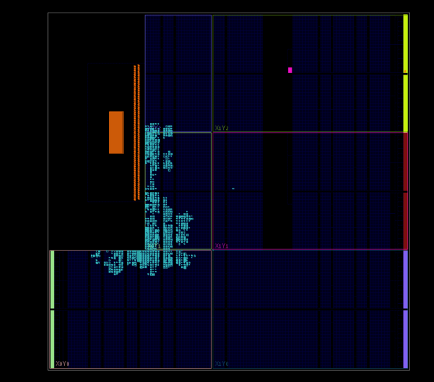

הלוגיקה מרוכזת באזור קטן ליד ממשקי ה-PS — תוצאה של ניצול משאבים נמוך ושל האלגוריתם שממקם לוגיקה קרוב לפורטי ה-AXI שאליהם היא מחוברת. קיצור מסלולי הניתוב תורם ישירות לשולי ה-Timing הרחבים.

---

## 12. אתגרים הנדסיים ופתרונות

| # | האתגר | הפתרון | העיקרון |
|---:|---|---|---|
| 1 | ה-FIFO מחזיר נתון במחזור העוקב ל-`rd_en`, אך ה-AXI-Stream Master היה צריך להעמיד נתון תקף מיד | הוספת מצב `LOAD` כמחזור המתנה בין בקשת הקריאה ובין השידור | תכנון ה-FSM חייב להתאים ל-**Latency האמיתי** של הבלוק שמולו הוא עובד |
| 2 | ה-Generator היה מקדם נתונים בזמן שה-FSM שולח Header ו-Length — ומאבד את שתי המילים הראשונות | `assign data_ready = (state == SEND_DATA)` — הקידום מותנה במצב ה-FSM | **Backpressure** אינה תוספת אופציונלית אלא חלק מהפרוטוקול |
| 3 | הפעלת ה-AXI-Stream Master בו-זמנית עם ה-FSM הייתה גורמת לו לרוץ אל FIFO ריק | הפעלה מ-`packet_done` דרך רגיסטור בן מחזור אחד | **סדר האירועים** חייב להיות מוגדר במפורש, לא מקרי |
| 4 | הסימולציה דיווחה כשלים לא-עקביים שלא שוחזרו | דגימה ב-`negedge` במקום `posedge` ב-Testbench | הימנעות מ-**Race Condition** בין עדכון רגיסטר ובין דגימתו בסימולטור |
| 5 | ה-Reset של ה-RTL הוא Active-High, אך `proc_sys_reset` מייצר `aresetn` שהוא Active-Low | חיבור ליציאה `peripheral_reset` — הפלט **Active-High** של אותו IP | קריאת התיעוד של ה-IP חוסכת שערי היפוך ובאגים של פולריות |
| 6 | דוח ה-Timing בשלב 7 היה ריק ולא ניתן לניתוח | זוהה כתוצאה נכונה: אין `create_clock` כשה-`clk` הוא פורט חיצוני. ניתוח אמיתי התאפשר בשלב 8 עם השעון מה-PS | **תוצאה ריקה אינה כשל** — יש להבין מה הכלי יכול ומה אינו יכול לנתח |

---

## 13. מגבלות ידועות והמשך פיתוח

תיעוד מדויק של מה שטרם נבדק חשוב לא פחות מתיעוד מה שעבד.

| # | המגבלה | הערכה ותיקון מתוכנן |
|---:|---|---|
| 1 | **בדיקת Backpressure לא בוצעה.** בכל ה-Testbenches האות `axis_tready` מוחזק ב-`1`. לוגיקת החזקת הנתון בעת `tready = 0` **מומשה** ב-RTL (הבלוק מחזיק `data_reg` על `tdata` ואינו מקדם את `word_count`), אך לא הופעלה בסימולציה. | הפער המשמעותי ביותר. ה-AXI DMA **רשאי ויכול** להנמיך `tready` כאשר אינו מוכן לקלוט, למשל בתנאי עומס על אפיק ה-DDR — התנהגות שטרם נצפתה בפועל בחומרה בפרויקט זה. **תיקון:** Testbench שמנמיך `tready` באופן פסאודו-אקראי ומאמת שאין אובדן נתונים ואין הזזת מילים. |
| 2 | **הגנת `!full` קיימת ב-Testbench אך לא ב-Block Design.** בסימולציה `fifo_wr_en = packet_valid && !fifo_full`; בחומרה `packet_valid` מחובר ישירות ל-`sync_fifo_0/wr_en`. | אינה תקלה במצב הנוכחי, פשוט מפני ש-**9 מילים < עומק 16**. שימו לב שהקריאה אינה מקבילה לכתיבה: ה-Master מופעל מ-`packet_done`, ולכן ה-FIFO מגיע לתפוסת שיא של 9 מילים לפני שמתחילה הקריאה. הופכת לרלוונטית בהרחבה ל-Packet ארוך מ-16 מילים. **תיקון:** הוספת שער AND ב-Block Design. |
| 3 | **אות ה-`start` מ-BTN0 אינו עובר Debounce או סינכרון.** הקלט האסינכרוני נכנס ישירות ל-`start` של שני בלוקים. | סיכון Metastability תיאורטי. בפועל, לחיצה מוחזקת ~50ms ב-50 MHz שווה כ-2.5 מיליון מחזורים, ולכן ה-FSM מייצר Packets חוזרים — התנהגות שאינה מפריעה לבדיקה. **תיקון:** שרשרת סינכרון בת שני רגיסטרים + Debounce + זיהוי Edge. |
| 4 | **Throughput של מילה לכל שני מחזורי שעון**, בשל מצב ה-`LOAD`. | פשרה מכוונת לטובת פשטות ונכונות. **שיפור:** FIFO מסוג FWFT או Prefetch של המילה הבאה. |
| 5 | **אין CDC — שעון יחיד בכל התכן.** | החלטה מכוונת שמסירה סיכון Metastability בשלב שבו המטרה היא להוכיח את מסלול ה-DMA. **המשך:** שלב 10. |

### המשך הפיתוח המתוכנן

| שלב | תוכן | ערך מוסף |
|---:|---|---|
| 9 | **אימות בתוכנה** — תוכנת C ב-Bare-Metal שמגדירה את ה-DMA, קולטת את ה-Packet ל-DDR ומאמתת אותו מילה-מילה, כולל ניהול Cache (Flush לפני ההעברה, Invalidate אחריה) | סגירת הלולאה: הוכחה שהנתונים אכן הגיעו ל-DDR נכונים |
| 10 | **Async FIFO + CDC** — FIFO עם שני שעונים בלתי תלויים, מצביעי Gray Code ושרשראות סינכרון | הנושא המקצועי המשמעותי ביותר שנותר. מערכות FPGA אמיתיות הן כמעט תמיד רב-שעוניות |
| 11 | **אינטגרציית CDC למערכת המלאה** | הוכחה שה-CDC עובד במערכת אמיתית ולא רק ב-Testbench |
| 12 | **ILA + דוחות Vivado** — חיבור ILA ל-`debug_state` ולאותות ה-AXI4-Stream | נראות לאותות פנימיים בזמן ריצה. היציאה `debug_state` הוכנה לכך מראש בשלב 5 |
| 13–14 | **ייצוא CSV וגרפים ב-Python** · **החלפת ה-Data Generator ב-UART או SPI** | שרשור המסלול עד לניתוח · מקור נתונים אמיתי |

---

## 14. סיכום

הפרויקט מדגים **מסלול חומרה מלא ומאומת** במערכת Zynq-7000: מלוגיקת RTL שנכתבה מאפס, דרך פרוטוקול AXI4-Stream תקני, ועד העברת נתונים לזיכרון DDR באמצעות AXI DMA.

**ברמת התכן:** ארבעה בלוקי RTL מודולריים, שכל אחד אומת בנפרד ב-Testbench עם בדיקות אוטומטיות; שרשרת מלאה שאומתה בסימולציית אינטגרציה עם PASS על כל תשע מילות ה-Packet; אריזה כ-Custom IP והרכבת מערכת ב-Block Design; והשלמת אינטגרציית החומרה ב-Vivado עם Zynq PS, AXI DMA ונתיב ה-DDR — עד Bitstream ו-Hardware Export.

**מה טרם הוכח:** **אימות Runtime** של העברת ה-DMA — כלומר הוכחה בפועל ש-36 הבתים נכתבו ל-DDR ונקראו בחזרה נכונים — **עדיין בתהליך**, ומהווה את שלב 9 בתוכנית העבודה. הדוח מתעד את מסלול החומרה כפי שנבנה ואומת בכלים, ולא כמערכת שהוכחה מקצה לקצה בזמן ריצה.

**ברמת האיכות:** התכן עומד **בכל** אילוצי ה-Timing עם שוליים של 11.884 ns מתוך 20 ns — 41% ניצול תקציב שעון, ואפס Endpoints כושלים מתוך 6,624. הלוגיקה המותאמת אישית תופסת 153 LUTs ו-204 FFs, פחות מ-0.3% מהרכיב.

**המתודולוגיה:** העיקרון החוזר הוא **בידוד משתנים לפני אינטגרציה**. הוא מופיע בכל שכבה: Testbench לכל בלוק לפני חיבור לשרשרת; אימות השרשרת המלאה בסימולציה לפני מעבר לחומרה; ומקור נתונים פנימי ידוע במקום ממשק חיצוני, כדי שכל תקלה תהיה בהכרח **בתוך** המסלול שנבנה.

הדגש בפרויקט אינו רק על כך שהמערכת עובדת, אלא על היכולת **להסביר מדוע כל החלטה נלקחה, מה נבדק, ומה טרם נבדק**.

---

## נספח — מבנה הפרויקט ואינדקס תוצרים

```text
Data_Project/
├── docs/     PROJECT_REPORT_HE.md (דוח זה) · data_protocol.md · work_plan.md · project_checklist.md
├── rtl/      data_generator.v · packet_builder_FSM.v · sync_fifo.v · axi_stream_master.v
├── tb/       tb_data_generator.v · tb_packet_builder_FSM.v · tb_sync_fifo.v
│             tb_axi_stream_master.v · tb_data_project_integration.v
├── ip_repo/  ארבעה Custom IP — {*.v, component.xml, xgui/*.tcl}
├── vivado/   Data_Project.xpr · Block Design · stage8_start_button.xdc · Bitstream
├── reports/  דוחות Timing, Utilization ו-Methodology של שלבים 7–8
└── images/   Waveforms, Screenshots ותרשימים
```

| דוח | תוכן |
|---|---|
| `stage2_data_generator_simulation.md` | דוח סימולציה מלא לשלב 2 |
| `stage7_synthesis_utilization_full_report.rpt` | ניצול משאבים — Synthesis, שלב 7 |
| `stage7_timing_summary_report.txt` | Timing שלב 7 (ללא אילוצים — ראו סעיף 9) |
| `stage8_implementation_utilization_report.rpt` | ניצול משאבים היררכי — לאחר Routing |
| `stage8_implementation_timing_summary.rpt` | Timing מלא — לאחר Routing |
| `stage8_implementation_methodology_report.rpt` | דוח Methodology של Vivado |

**תמונות:** תרשים בלוקים · Waveforms של שלבים 2–6 · פלט Console של אינטגרציית RTL · Block Design של שלבים 7–8 · Address Editor · סיכומי Utilization ו-Timing · מיקום פיזי על הרכיב.

---

**Data Project — Zynq DDR Data Logger** · Dvir Gedanken · Zybo Z7-20 · Vivado 2019.1
